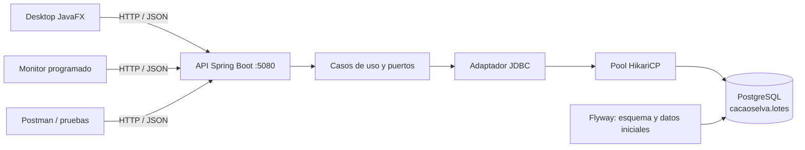

# CacaoSelva

[](https://github.com/JaqzO8/CacaoSelva/actions/workflows/ci.yml)

Aplicación académica Java 21 con **API REST, Desktop JavaFX y Monitor**, organizada en seis módulos Maven con Arquitectura Limpia. Los lotes se almacenan en **PostgreSQL** y permanecen disponibles al reiniciar las aplicaciones.

**Primera instalación:** sigue el [manual de usuario](docs/MANUAL_USUARIO.md), con requisitos, clonación, credenciales, uso del Desktop, Monitor y solución de problemas. El repositorio se puede clonar sin cuenta de GitHub.

## Inicio rápido

Requisitos: JDK 21, PostgreSQL 17 o superior instalado y PowerShell 7. Maven Wrapper descarga Maven automáticamente. Ejecuta los comandos desde la raíz del proyecto.

```powershell
git clone https://github.com/JaqzO8/CacaoSelva.git
cd CacaoSelva

# Crear/iniciar la instancia PostgreSQL del proyecto (idempotente)
pwsh -NoProfile -File scripts/database.ps1 start

# Compilar y ejecutar las pruebas unitarias
.\mvnw.cmd clean install

# Terminal 1: API y migraciones de base de datos
pwsh -NoProfile -File scripts/run-api.ps1

# Terminal 2: Desktop
.\mvnw.cmd -pl desktop javafx:run

# Terminal 3: Monitor
pwsh -NoProfile -File scripts/run-monitor.ps1
```

Los scripts de API y Monitor cargan sus variables desde `.env.local` al proceso; no las publiques ni las pegues en comandos.

Abre el `pom.xml` raíz en IntelliJ IDEA o la carpeta en VS Code con Extension Pack for Java. Selecciona JDK 21. No se usa Lombok ni Docker.

## Base de datos y credenciales

La instalación local del proyecto utiliza:

| Parámetro | Valor |
|---|---|
| Motor | PostgreSQL 17 |
| Host | `127.0.0.1` |
| Puerto | `55432` |
| Base de datos | `cacaoselva` |
| Esquema | `cacaoselva` |
| Usuario de aplicación | `cacaoselva` |
| Contraseña | Generada aleatoriamente, en `.env.local` |
| Datos en disco | `data/postgres/` |

La instancia está separada de otros servicios PostgreSQL instalados. El usuario de aplicación es propietario de su base y no es superusuario. El administrador local de esta instancia y su contraseña se guardan en `data/database.json`; los scripts usan esas credenciales exclusivamente para aprovisionar y crear bases temporales de prueba. Ambos archivos de credenciales quedan fuera del control de versiones.

```powershell
pwsh -NoProfile -File scripts/database.ps1 status
pwsh -NoProfile -File scripts/database.ps1 stop
pwsh -NoProfile -File scripts/database.ps1 start
```

El servidor permanece activo al detener la API; después de reiniciar Windows se vuelve a iniciar con el último comando. Los scripts no registran un servicio de Windows ni modifican los servicios PostgreSQL existentes. Para usar otro servidor, configura `CACAOSELVA_DB_URL`, `CACAOSELVA_DB_USER` y `CACAOSELVA_DB_PASSWORD` en variables de entorno o en `.env.local` (formato `CLAVE=valor`, sin comillas). Las variables de entorno tienen prioridad. Puedes usar `.env.example` como referencia.

**Persistencia no significa mantener una conexión abierta indefinidamente:** PostgreSQL conserva los datos en disco; HikariCP administra un pool de hasta cinco conexiones y el repositorio toma/devuelve una por operación. El timeout de adquisición es de tres segundos.

Flyway aplica automáticamente:

- `V1__crear_lotes.sql`: tabla con identidad generada, peso `DECIMAL(12,3)`, restricciones e índice de estado.
- `V2__cargar_lotes_demostracion.sql`: 30 lotes ficticios; 20 pendientes y 10 liquidados. Conserva Ana, Luis y Rosa como primeros registros.

La carga se ejecuta una sola vez por base. Reiniciar no repone registros eliminados, no duplica datos y no sobrescribe cambios. Las nuevas modificaciones de esquema se agregan en migraciones posteriores, sin editar una migración ya aplicada. Para respaldar, usa `pg_dump`; evita copiar el directorio de PostgreSQL mientras está activo.

## Arquitectura y módulos



Este diagrama describe el recorrido de ejecución. Las dependencias del código apuntan hacia dentro: las interfaces del repositorio viven en `application`; la implementación JDBC las implementa desde `infrastructure`. [Diagrama y decisiones](docs/ARQUITECTURA.md).

| Módulo | Dependencias internas | Responsabilidad |
|---|---|---|
| `domain` | Ninguna | `Lote`, `DatosLote`, `EstadoLote` y validaciones |
| `application` | `domain` | Casos de uso, puertos, DTOs y excepciones |
| `infrastructure` | `application` | JDBC, repositorio en memoria de referencia y adaptador HTTP |
| `api` | `application`, `infrastructure` | Spring, rutas, JSON, PostgreSQL, Hikari y Flyway |
| `desktop` | `application`, `infrastructure` | Controles JavaFX, formulario y coordinación asíncrona |
| `monitor` | `application`, `infrastructure` | Planificador, conteo y recuperación |

```text
CacaoSelva/
├── pom.xml / mvnw / mvnw.cmd / .mvn/
├── domain/                  # model, exception, tests
├── application/             # port, dto, usecase, exception, tests
├── infrastructure/          # repository, http, config, tests
├── api/                     # controller, config, dto, mapper, exception
│   └── src/main/resources/db/migration/
├── desktop/                 # controller, view, CSS, tests JavaFX
├── monitor/                 # config, service, logging, tests
├── scripts/                 # database.ps1, verify.ps1, smoke-test.ps1
├── .github/workflows/ci.yml
├── docs/                    # arquitectura, análisis, validación y Postman
├── .env.example
├── .env.local               # Credenciales locales; ignorado por Git
└── data/                    # PostgreSQL local; ignorado por Git
```

Clases de entrada: `CacaoSelvaApiApplication`, `CacaoSelvaDesktopApplication` y `CacaoSelvaMonitorApplication`.

## API y CRUD

Base: `http://localhost:5080`.

| Método y ruta | Respuesta |
|---|---|
| `GET /lotes` | 200, lista completa ordenada por ID |
| `GET /lotes?page=0&size=20` | 200, resultados paginados; filtros opcionales `estado`, `socioId`, `socio` |
| `GET /lotes/{id}` | 200, lote; 404 si no existe |
| `GET /lotes/{id}/historial` | 200, eventos de auditoría del lote |
| `GET /lotes/pendientes/conteo` | 200, `{"pendientes":20}` inicialmente |
| `GET /socios` y `GET /socios/buscar?dni=...` | 200, socios registrados |
| `POST /socios` | 201, nuevo socio (solo ADMIN) |
| `POST /auth/login` | 200, entrega token JWT |
| `POST /auth/usuarios` | 201, usuario nuevo (solo ADMIN) |
| `GET /actuator/health` | 200, estado de API y PostgreSQL |
| `POST /lotes` | 201, lote creado y cabecera Location |
| `PUT /lotes/{id}` | 200, reemplazo de socio/peso/estado/version; 409 si hubo una edición simultánea |
| `DELETE /lotes/{id}` | 204 sin cuerpo; 404 si no existe |

Excepto login y salud, las rutas requieren `Authorization: Bearer <token>`. Desktop pide inicio de sesión; el usuario inicial es `admin` y su contraseña aleatoria está en `CACAOSELVA_ADMIN_PASSWORD` dentro de `.env.local`. No publiques ni compartas ese archivo. Para crear un lote, usa el ID de un socio existente:

```json
{"socioId":1,"pesoKg":125.375,"estado":"PENDIENTE"}
```

Los IDs deben ser enteros positivos; el peso debe ser positivo, hasta `999999999.999` y con máximo tres decimales; estado debe ser `PENDIENTE` o `LIQUIDADO`. Las actualizaciones envían la versión recibida en el GET para detectar conflictos. Campos desconocidos, JSON incorrecto y datos inválidos devuelven 400. No se utiliza `double` para almacenar pesos.

Errores de negocio y persistencia se traducen en `ApiExceptionHandler`:

```json
{"status":404,"message":"No existe el lote con id 999","timestamp":"2026-09-21T16:00:00Z"}
```

Un fallo de almacenamiento devuelve 503 y registra el detalle técnico solo en el servidor.

## Desktop

- Consulta asíncrona: indicador de progreso, controles bloqueados durante la petición y actualización mediante `Platform.runLater`.
- Filtros por socio/ID y estado, ordenamiento de columnas y contador de filas visibles.
- Formulario para crear lotes; selecciona una fila para editarla. **Nuevo lote** limpia la selección.
- Eliminación con confirmación explícita en la ventana.
- Hora de última consulta exitosa y limpieza de datos antiguos cuando una consulta falla.
- Ante una escritura sin respuesta confirmada, indica consultar antes de repetir; no reintenta escrituras automáticamente, para evitar duplicados.


## Monitor

Consulta inmediatamente y luego utiliza `scheduleWithFixedDelay`: espera el intervalo después de terminar cada consulta, sin solapamiento. Registra pendientes, cambios respecto del conteo anterior, fallos consecutivos y recuperación de conexión. Una interrupción al cerrar no se anuncia como falla de red. El cierre libera el ejecutor y el cliente HTTP.

| Configuración | Variable de entorno | Propiedad JVM | Valor inicial |
|---|---|---|---|
| API de ambos clientes | `CACAOSELVA_API_BASE_URL` | `cacaoselva.api.baseUrl` | `http://localhost:5080` |
| Timeout HTTP | `CACAOSELVA_API_TIMEOUT_SECONDS` | `cacaoselva.api.timeoutSeconds` | 5 segundos |
| Intervalo Monitor | `CACAOSELVA_MONITOR_INTERVAL_SECONDS` | `cacaoselva.monitor.intervalSeconds` | 10 segundos; mínimo 1 |
| Token Monitor | `CACAOSELVA_API_TOKEN` | `cacaoselva.api.token` | sin valor; configura un token JWT |
| Cuenta Monitor | `CACAOSELVA_API_USERNAME` / `CACAOSELVA_API_PASSWORD` | `cacaoselva.api.username` / `cacaoselva.api.password` | sin valor; alternativa al token |

Las propiedades JVM tienen prioridad sobre las variables de entorno. Ejemplo:

```powershell
java '-Dcacaoselva.monitor.intervalSeconds=5' -jar monitor/target/monitor-1.0.0-SNAPSHOT.jar
```

## Pruebas automatizadas

**Verificación completa con un comando:**

```powershell
pwsh -NoProfile -File scripts/verify.ps1 -Gui -Postman
```

Requiere sesión gráfica para `-Gui` y Node.js/npm para `-Postman`. El script crea una base `cacaoselva_test_<id>` independiente, configura las credenciales solo para el proceso, compila todos los módulos, ejecuta pruebas unitarias y de integración PostgreSQL, prueba controles JavaFX, ejecuta la colección Postman y comprueba persistencia tras reiniciar la API y recuperación del Monitor. Al terminar cierra sus aplicaciones y elimina únicamente la base temporal que creó. **No prueba ni borra datos de la base de uso normal.**

Si Newman no está en PATH, el script lo prepara automáticamente en `.tools/newman`, sin instalación global.

Sin interfaz gráfica ni Node.js:

```powershell
pwsh -NoProfile -File scripts/verify.ps1
```

Solo pruebas unitarias (sin servidor de base de datos):

```powershell
.\mvnw.cmd test
```

Las pruebas PostgreSQL se ejecutan con el perfil Maven `integration` mediante Failsafe; `verify.ps1` prepara sus variables y evita usar una base normal por error. Los reportes están en `target/surefire-reports/`, `api/target/failsafe-reports/` y `.tools/validation/`. [Resultados](docs/VALIDACION.md).

La automatización de [GitHub Actions](https://github.com/JaqzO8/CacaoSelva/actions/workflows/ci.yml) ejecuta la verificación con PostgreSQL local y Xvfb en cada push, pull request o ejecución manual. No necesita Docker. Cada ejecución publica los reportes y una captura de la prueba JavaFX como artefactos descargables.

[Guía de Postman](docs/postman/README.md) y [colección importable](docs/postman/CacaoSelva.postman_collection.json).

## Decisiones y límites

SRP: cada caso de uso coordina una operación; los controladores no contienen SQL ni reglas de conteo. DIP: los casos de uso reciben interfaces. ISP: las escrituras utilizan `LoteWritePort`, separado de las consultas; el repositorio en memoria sigue siendo solo de lectura. OCP: JDBC sustituye al almacenamiento original mediante configuración externa. LSP: lecturas y escrituras respetan sus contratos, incluyendo ausencia mediante Optional/boolean.

El dominio y la aplicación no dependen de Spring, JDBC, JavaFX ni Jackson. Los datos entrantes se validan en dominio; las consultas SQL son parametrizadas y las conexiones se cierran con `try-with-resources`. Cada escritura SQL individual es atómica. El pool y las migraciones se configuran en la capa externa.

Alcance académico local: sin autenticación/autorización, paginación, edición concurrente con control de versión ni despliegue productivo. Dos ediciones simultáneas conservan la última escritura. La aplicación trabaja en una sesión gráfica para Desktop; el Monitor puede ejecutarse sin ella. [Análisis breve de mejoras](docs/ANALISIS.md).

Referencias: [PostgreSQL: identidades](https://www.postgresql.org/docs/17/ddl-identity-columns.html), [Spring Boot: inicialización y Flyway](https://docs.spring.io/spring-boot/how-to/data-initialization.html), [Flyway PostgreSQL](https://documentation.red-gate.com/flyway/reference/database-driver-reference/postgresql-database).
