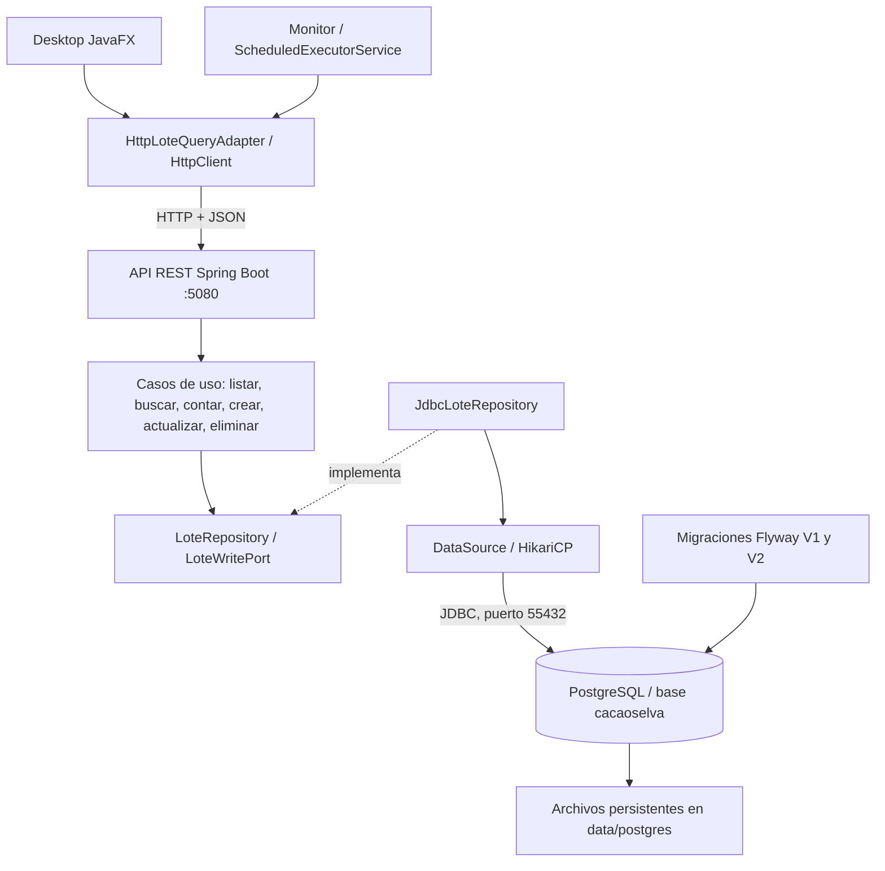

# Arquitectura y conexión persistente



Las flechas continuas muestran comunicación en ejecución; la flecha discontinua muestra implementación de interfaces. Los casos de uso conocen los puertos; la configuración de Spring inyecta JDBC como implementación. Desktop y Monitor no acceden a la base directamente.

Dependencias de código:

```text
domain <- application <- infrastructure
               ^                ^
               +-- api ---------+
               +-- desktop -----+
               +-- monitor -----+
```

`domain` contiene únicamente Java estándar. `application` depende de dominio. JDBC pertenece a infraestructura. Spring, el driver PostgreSQL, Hikari y Flyway se configuran en `api`; JavaFX existe únicamente en `desktop`.

## Conexión y ciclo de vida

1. La API lee `.env.local` o las variables de entorno y abre el pool JDBC.
2. Flyway crea el esquema `cacaoselva`, aplica la tabla y carga los 30 registros iniciales una sola vez.
3. Un endpoint invoca un caso de uso; este valida la entrada y llama al puerto.
4. El adaptador toma una conexión, ejecuta SQL parametrizado y devuelve la conexión al pool.
5. La API transforma el resultado a JSON; los clientes lo reciben a través del adaptador HTTP.
6. Cerrar la API libera el pool. Los registros permanecen en PostgreSQL; al volver a iniciar se leen sin recarga ni reemplazo.

## Tabla

| Columna | Tipo | Restricción |
|---|---|---|
| id | INTEGER | PK, GENERATED ALWAYS AS IDENTITY |
| socio | VARCHAR(120) | No nulo ni vacío |
| peso_kg | DECIMAL(12,3) | Mayor que cero |
| estado | VARCHAR(16) | PENDIENTE o LIQUIDADO |

Índice de estado: `idx_lotes_estado`. Historial de migraciones: `cacaoselva.flyway_schema_history`.

## Pruebas aisladas

`verify.ps1` usa la instancia del proyecto y crea una base distinta `cacaoselva_test_<id>` para cada ejecución. Allí se aplican las mismas migraciones y se prueban los mismos adaptadores. La API de prueba usa el puerto 5081; la API normal usa 5080. Al finalizar se elimina exclusivamente la base temporal generada por el script.
