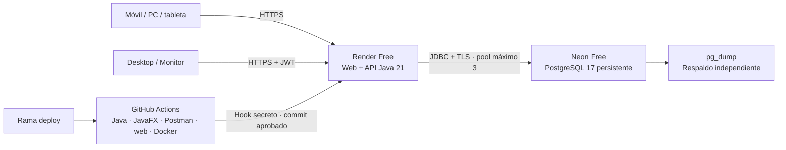

# Publicación gratuita y persistencia

## Arquitectura



La web y la API se sirven en el mismo origen; las operaciones requieren JWT. PostgreSQL conserva socios, usuarios, lotes, versiones y auditoría. Flyway aplica las migraciones una sola vez por base. No se guardan los datos de negocio en el sistema de archivos de Render ni en el navegador.

## Recursos

1. Crea un proyecto **Free** de Neon, PostgreSQL 17, base `cacaoselva`, sin servicios adicionales. Usa la conexión directa para migraciones y un pool de tres conexiones.
2. Crea un **Web Service** en Render desde `https://github.com/JaqzO8/CacaoSelva`, rama **deploy**, lenguaje **Docker**, archivo `./Dockerfile`, plan **Free**.
3. Selecciona `/actuator/health` como health check y **Auto-Deploy: Off**. GitHub Actions decide cuándo publicar después de las pruebas.
4. Configura las variables de entorno siguientes en Render. No añadas credenciales al repositorio.

| Variable | Contenido |
|---|---|
| `SPRING_PROFILES_ACTIVE` | `prod` |
| `CACAOSELVA_DB_URL` | `jdbc:postgresql://HOST_NEON:5432/cacaoselva?sslmode=require&channelBinding=require` |
| `CACAOSELVA_DB_USER` | Usuario de la conexión de Neon |
| `CACAOSELVA_DB_PASSWORD` | Contraseña de Neon |
| `CACAOSELVA_JWT_SECRET` | Secreto aleatorio de al menos 32 caracteres, estable entre despliegues |
| `CACAOSELVA_ADMIN_PASSWORD` | Contraseña aleatoria de al menos 12 caracteres para el primer administrador |
| `CACAOSELVA_REGISTRATION_ENABLED` | `true` |

El administrador inicial se llama `admin`. Su contraseña se obtiene de la variable privada de Render; no se publica en este manual. Cambiar esa variable después de crear el administrador **no cambia la contraseña ya almacenada**. Conserva las credenciales en tu gestor de contraseñas.

## GitHub Actions

En Settings → Secrets and variables → Actions:

- Añade el secreto `RENDER_DEPLOY_HOOK_URL` copiando el Deploy Hook de Settings de Render.
- Añade la variable `RENDER_SERVICE_URL` con la URL HTTPS pública, sin barra final.

El workflow `ci.yml` ejecuta las pruebas en PostgreSQL temporal, pruebas JavaFX, pruebas web en 1365, 768, 375 y 320 píxeles, Postman y construcción Docker. Si pasan y la rama es `deploy`, el job `deploy` envía el SHA probado a Render. Después comprueba que `/actuator/info` devuelve ese SHA y `/actuator/health` devuelve `UP`. Los despliegues se serializan.

Sin URL configurada, el job de publicación se omite explícitamente. Con URL pero sin hook, falla indicando el secreto pendiente; pasar las pruebas por sí solo no significa que la web esté publicada.

## Qué conserva los datos

Los datos permanecen al recargar la página, cambiar de dispositivo, cerrar sesión, suspender o reiniciar Render y volver a desplegar. Eso depende de que Render siga conectado al mismo proyecto y base de Neon. Las sesiones del navegador son independientes de los registros guardados.

El plan gratuito no ofrece disponibilidad continua ni conservación absoluta ante eliminación de la base, cierre de cuenta, errores del usuario o cambios del proveedor. Render suspende la web después de 15 minutos de inactividad y puede tardar aproximadamente un minuto en arrancar. Neon también puede suspender el cómputo conservando el almacenamiento. Los límites gratuitos pueden impedir temporalmente el acceso o nuevos registros al agotar la cuota. Revisa las cuotas de tus paneles.

Fuentes: [Render Free](https://render.com/docs/free), [Deploy Hooks](https://render.com/docs/deploy-hooks), [Planes de Neon](https://neon.com/docs/introduction/plans). Consulta estas páginas antes de ampliar el uso. No se utiliza Render PostgreSQL Free, cuya base caduca a los 30 días.

## Respaldo y recuperación

Exporta regularmente con `pg_dump` de PostgreSQL 17 o posterior. Usa las variables locales `PGHOST`, `PGPORT`, `PGDATABASE`, `PGUSER`, `PGPASSWORD` y `PGSSLMODE=require` obtenidas de Neon. No incluyas contraseñas en el comando ni subas el archivo a Git.

```powershell
pg_dump --format=custom --no-owner --no-acl --file=cacaoselva.backup
```

Guarda una copia protegida fuera de Neon. Para recuperar, crea una base vacía y configura las variables de conexión apuntando a ella; después ejecuta:

```powershell
pg_restore --no-owner --no-acl --exit-on-error --dbname=$env:PGDATABASE cacaoselva.backup
```

La copia incluye historial de Flyway, usuarios y auditoría. Verifica la restauración en una base separada antes de usarla. Los archivos `.backup` y `.dump` están excluidos de Git. El restablecimiento de lotes eliminados requiere una copia o una ventana de restauración disponible en el proveedor.
