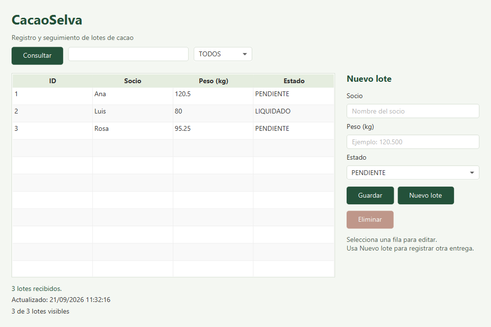

# Manual de usuario de CacaoSelva

CacaoSelva permite consultar, registrar, modificar y eliminar lotes de cacao. La aplicación de escritorio se comunica con una API; PostgreSQL guarda los datos y el Monitor informa cuántos lotes siguen pendientes.

Repositorio público: [JaqzO8/CacaoSelva](https://github.com/JaqzO8/CacaoSelva). Puedes clonarlo y consultar su documentación sin iniciar sesión en GitHub. Publicar el código no inicia un servidor remoto: cada persona ejecuta la aplicación en su equipo.

## 1. Preparar el equipo

La guía principal usa **Windows y PowerShell 7**. Instala estos componentes desde sus páginas oficiales:

| Componente | Instalación y función |
|---|---|
| [Git para Windows](https://git-scm.com/install/windows) | Permite clonar y actualizar el proyecto. |
| [JDK 21, Eclipse Temurin](https://adoptium.net/temurin/releases/?version=21) | Selecciona versión **21**, tipo **JDK** y la arquitectura de tu equipo. Configura `JAVA_HOME` y añade el directorio `bin` a `PATH`. |
| [PostgreSQL para Windows](https://www.postgresql.org/download/windows/) | Instala PostgreSQL **17** con las herramientas de línea de comandos. El proyecto crea su propia instancia local. |
| [PowerShell 7](https://learn.microsoft.com/en-us/powershell/scripting/install/installing-powershell-on-windows) | Los scripts se ejecutan con `pwsh`; Windows PowerShell 5.1 no es suficiente. |
| [Node.js](https://nodejs.org/en/download) | Opcional: versión 22 o 24, con npm, para ejecutar también las pruebas Postman. |

No necesitas instalar Maven, JavaFX SDK ni Docker: Maven Wrapper descarga Maven y las dependencias del proyecto. La primera compilación requiere Internet. Desktop necesita una sesión gráfica.

Cierra y vuelve a abrir la terminal después de instalar. Comprueba:

```powershell
git --version
java -version
javac -version
pwsh --version
```

Java y `javac` deben indicar versión 21. PostgreSQL se detecta desde `PATH` o desde `C:\Program Files\PostgreSQL`. Si se instaló en otra ubicación, añade su carpeta `bin` a `PATH`; debe contener `pg_ctl`, `initdb` y `psql`.

La contraseña que solicita el instalador de PostgreSQL corresponde a su servicio general. **CacaoSelva genera otras credenciales para su propia instancia**; no necesitas introducir la contraseña del servicio general en este proyecto.

## 2. Clonar el repositorio

En una carpeta donde tengas permiso de escritura, ejecuta:

```powershell
git clone https://github.com/JaqzO8/CacaoSelva.git
cd CacaoSelva
```

Ejecuta todos los comandos siguientes desde esta carpeta, donde está `pom.xml`. Puedes abrirla en tu editor, pero no necesitas un IDE para utilizar la aplicación. No hace falta un token de GitHub para clonar.

## 3. Crear la base de datos y compilar

```powershell
pwsh -NoProfile -File scripts/database.ps1 start
.\mvnw.cmd clean install
```

Continúa cuando la compilación termine con `BUILD SUCCESS`. El primer comando crea e inicia PostgreSQL; ejecutarlo de nuevo reutiliza la misma instancia. No copies `.env.example` antes de este paso: el script genera `.env.local` automáticamente y evita sobrescribir configuraciones existentes.

| Dato de conexión | Valor predeterminado |
|---|---|
| Host | `127.0.0.1` |
| Puerto | `55432` |
| Base de datos | `cacaoselva` |
| Esquema | `cacaoselva` |
| Usuario | `cacaoselva` |
| Contraseña | Valor de `CACAOSELVA_DB_PASSWORD` en `.env.local` |

Para ver tus credenciales localmente:

```powershell
Get-Content .env.local
```

Cada clonación nueva genera contraseñas distintas. `.env.local` contiene la conexión PostgreSQL, el secreto JWT y la contraseña de inicio para `admin` (variable `CACAOSELVA_ADMIN_PASSWORD`). `data/database.json` contiene credenciales administrativas de PostgreSQL; `data/postgres/` contiene la base. Git los ignora. Conserva estos archivos en tu equipo y no los añadas al repositorio ni los compartas. El usuario de base de datos de aplicación no es superusuario.

Si el puerto 55432 ya está ocupado, **en la primera inicialización** usa:

```powershell
pwsh -NoProfile -File scripts/database.ps1 start -Port 55433
```

Las ejecuciones posteriores reutilizan el puerto guardado en `data/database.json`. El argumento `-Port` no cambia el puerto de una instancia ya creada.

## 4. Iniciar la aplicación

Abre tres terminales en la raíz del mismo proyecto. Mantén cada comando en ejecución mientras uses ese componente.

**Terminal 1: API**

```powershell
pwsh -NoProfile -File scripts/run-api.ps1
```

Espera a que el registro indique que la aplicación inició. En este primer arranque, Flyway crea las tablas y carga **30 lotes ficticios: 20 pendientes y 10 liquidados**. En los arranques siguientes conserva los cambios, sin duplicar ni volver a cargar los lotes eliminados. El servidor queda en `http://localhost:5080`.

La salud pública de la API se consulta en [http://localhost:5080/actuator/health](http://localhost:5080/actuator/health). Las rutas de datos requieren JWT y por eso no se abren directamente sin token.

**Terminal 2: Desktop**

```powershell
.\mvnw.cmd -pl desktop javafx:run
```

En la ventana de acceso, inicia con el usuario `admin` y la contraseña `CACAOSELVA_ADMIN_PASSWORD` que se generó en `.env.local`. Desktop recibe lotes paginados desde la API; puedes filtrar por estado o socio, navegar páginas y volver a consultar. Al modificar un lote usa la versión que leyó; si otra persona lo cambió, consulta de nuevo y vuelve a editar.

**Terminal 3: Monitor**

El script carga la configuración privada de `.env.local` para autenticar el Monitor sin mostrar contraseñas en el comando.

```powershell
pwsh -NoProfile -File scripts/run-monitor.ps1
```

La API debe estar disponible para consultar o guardar datos. El Monitor es opcional para operar Desktop.

## 5. Usar Desktop



La captura utiliza tres registros de prueba; tu instalación nueva contiene 30.

### Consultar y buscar

1. Presiona **Consultar**. La ventana muestra progreso mientras obtiene los datos.
2. Escribe un nombre de socio o ID en el filtro y, si lo necesitas, selecciona un estado.
3. Pulsa el encabezado de una columna para ordenar. El contador indica cuántas filas coinciden con los filtros.
4. Para ver cambios realizados desde otro cliente, presiona **Consultar** nuevamente. Revisa la hora de la última consulta correcta.

### Crear un lote

1. Presiona **Nuevo lote**.
2. Introduce el socio, el peso en kilogramos y el estado.
3. Por ejemplo: socio `Cooperativa de prueba`, peso `125.375`, estado `PENDIENTE`.
4. Presiona **Guardar**. La base asigna el ID y la tabla se actualiza. Si el registro no aparece, revisa los filtros activos.

El socio es obligatorio y admite hasta 120 caracteres. El peso debe ser mayor que cero, hasta `999999999.999`, con un máximo de tres decimales significativos. En Desktop puedes usar punto o coma decimal, sin separadores de miles. Los estados disponibles son `PENDIENTE` y `LIQUIDADO`.

### Modificar o liquidar un lote

Selecciona una fila, cambia los campos del formulario y presiona **Guardar**. Para marcar un lote como liquidado, cambia su estado a `LIQUIDADO`. Mantiene su ID. **Nuevo lote** abandona la selección y prepara un registro nuevo.

### Eliminar un lote

Selecciona la fila, presiona **Eliminar** y confirma en el diálogo. Si cancelas, el lote permanece. La eliminación es definitiva en la aplicación; no hay papelera.

### Si falla la conexión

La barra de estado informa del error y una consulta fallida limpia los datos antiguos. Comprueba que PostgreSQL y la API estén activos y vuelve a consultar. Si falla una operación de guardado sin confirmación, **consulta antes de repetirla**: el servidor podría haberla procesado aunque la respuesta no llegara.

## 6. Leer el Monitor

El Monitor consulta al iniciar y después espera diez segundos entre consultas. Informa del número de pendientes, cambios en el conteo, fallos de conexión y recuperación. Si la API se detiene, sigue intentando conectarse; no es necesario reiniciarlo.

Para cambiar el intervalo a cinco segundos:

```powershell
java '-Dcacaoselva.monitor.intervalSeconds=5' -jar monitor/target/monitor-1.0.0-SNAPSHOT.jar
```

El Monitor solo consulta; no modifica lotes. El intervalo mínimo es un segundo.

## 7. Cerrar y volver a abrir

1. Cierra la ventana Desktop.
2. Presiona `Ctrl+C` en las terminales del Monitor y de la API.
3. Para detener también PostgreSQL, ejecuta:

```powershell
pwsh -NoProfile -File scripts/database.ps1 stop
```

Los datos permanecen en disco. Después de reiniciar el equipo, ejecuta `database.ps1 start` y vuelve a iniciar los componentes de la sección 4. No necesitas recompilar si el código no cambió. Esta instancia no se registra como servicio de Windows ni se inicia automáticamente al encender el equipo.

Consulta su estado con:

```powershell
pwsh -NoProfile -File scripts/database.ps1 status
```

## 8. Ejecutar las pruebas automáticas

Desde una sesión gráfica, con Node.js/npm disponibles y el puerto 5081 libre:

```powershell
pwsh -NoProfile -File scripts/verify.ps1 -Gui -Postman
```

El script compila y ejecuta las pruebas Java, integración PostgreSQL, controles JavaFX, colección Postman y recuperación de los procesos. Newman se instala automáticamente en `.tools/newman` si hace falta. Usa una base temporal distinta de la base normal y la elimina al terminar. Se espera el mensaje `VALIDACIÓN COMPLETA` y salida sin errores.

Sin sesión gráfica ni Node.js, ejecuta `pwsh -NoProfile -File scripts/verify.ps1`. Para ejecutar únicamente pruebas unitarias sin base de datos, usa `.\mvnw.cmd test`.

Los [resultados y reportes](VALIDACION.md) explican la cobertura. [GitHub Actions](https://github.com/JaqzO8/CacaoSelva/actions/workflows/ci.yml) ejecuta la verificación completa en cada cambio publicado. Puedes abrir una ejecución para ver sus pasos y descargar sus artefactos.

## 9. Actualizar y conservar los datos

Cierra Desktop, Monitor y API antes de actualizar. Conserva `.env.local` y `data/`; **no borres `data/` para actualizar**. Para respaldos, utiliza `pg_dump` o la opción de copia de seguridad de pgAdmin con las credenciales de la sección 3; no copies los archivos internos de PostgreSQL mientras el servidor está activo.

```powershell
git pull --ff-only
.\mvnw.cmd clean install
pwsh -NoProfile -File scripts/database.ps1 start
```

Inicia nuevamente la API, Desktop y Monitor. Flyway aplica las migraciones nuevas al arrancar la API. Si `git pull` indica cambios locales, resuélvelos antes de actualizar; no los descartes sin revisarlos. `clean` elimina resultados de compilación, no la base de datos.

## 10. Resolver problemas habituales

| Mensaje o síntoma | Qué revisar |
|---|---|
| `git`, `java`, `javac` o `pwsh` no se reconoce | Instala el componente, revisa `PATH` y abre una terminal nueva. |
| Java no es 21 o `release version 21 not supported` | Ajusta `JAVA_HOME` al JDK 21 y pon su `bin` primero en `PATH`. Comprueba `.\mvnw.cmd --version`. |
| No se encuentra `pg_ctl` o falla `initdb` | Instala las herramientas de PostgreSQL; añade su carpeta `bin` a `PATH` si no está en la ubicación habitual. |
| Puerto 55432 ocupado al crear la base | Usa `-Port 55433` en la primera inicialización. No detengas servicios ajenos al proyecto. |
| PostgreSQL no inicia | Revisa `data/postgres.log` y que los binarios correspondan a la versión que creó la instancia. |
| Ya existe `.env.local` y no se ha creado la instancia | El script protege la configuración existente. Si era una copia vacía de ejemplo, renómbrala a `.env.local.bak` y vuelve a ejecutar `start`. Si contiene una conexión válida, utiliza la configuración externa descrita más abajo. |
| API: puerto 5080 ocupado | Cierra la instancia anterior de CacaoSelva o cambia el puerto y configura ambos clientes como se indica abajo. |
| API: contraseña incorrecta o conexión rechazada | Inicia PostgreSQL y revisa `.env.local`. Ejecuta desde la raíz. Comprueba que no haya variables `CACAOSELVA_DB_*` antiguas, porque tienen prioridad. |
| Desktop no muestra registros | Presiona **Consultar**, quita filtros y comprueba `http://localhost:5080/lotes`. |
| Desktop: dependencias internas no encontradas | Ejecuta primero `.\mvnw.cmd clean install` desde la raíz; luego inicia Desktop. |
| Monitor informa fallos repetidos | Comprueba la API y su dirección. El Monitor se recupera automáticamente al restablecer la conexión. |
| Las pruebas no pueden usar 5081 | Detén únicamente la aplicación propia que esté ocupando ese puerto y vuelve a verificar. |

### Usar otra dirección de API

Inicia la API en otro puerto, por ejemplo:

```powershell
java -jar api/target/api-1.0.0-SNAPSHOT.jar --server.port=5082
```

En **cada terminal de Desktop y Monitor**, antes del comando de arranque:

```powershell
$env:CACAOSELVA_API_BASE_URL = 'http://localhost:5082'
```

### Usar un servidor PostgreSQL propio

Como alternativa al aprovisionamiento local, crea una base destinada a CacaoSelva y un usuario con permisos para crear su esquema y tablas. Copia `.env.example` a `.env.local` y completa URL JDBC, usuario y contraseña. No ejecutes `database.ps1` para administrar ese servidor externo. Los valores de `.env.local` se escriben sin comillas. La API carga las migraciones automáticamente.

La verificación completa de este repositorio administra su propia instancia local. Para esta alternativa externa, ejecuta la verificación en otra clonación con el aprovisionamiento local; no dirijas las pruebas a tu base de uso normal.

## 11. Linux y documentación técnica

En Linux usa `./mvnw` en lugar de `.\mvnw.cmd`. Los scripts también requieren PowerShell 7, PostgreSQL y JDK 21. PostgreSQL debe ejecutarse como un usuario normal, no como `root`. Desktop requiere una sesión gráfica y las bibliotecas GTK. El [workflow](../.github/workflows/ci.yml) muestra la preparación del entorno Ubuntu y la ejecución gráfica con Xvfb para automatización; Windows es el recorrido de instalación de este manual.

- [Arquitectura y conexión](ARQUITECTURA.md).
- [Análisis de mejoras](ANALISIS.md).
- [Rutas de la API y configuración](../README.md#api-y-crud).
- [Colección y guía de Postman](postman/README.md).

El alcance es académico y local. No incluye cuentas de usuario ni permisos de acceso; su publicación en GitHub corresponde al código fuente, no a un despliegue de producción.
